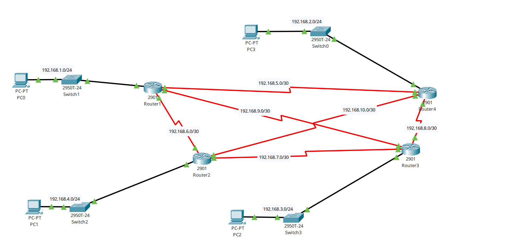

# Prompt User

En tu rol de ingeniero certificado CNA de Cisco, debes revisar el escenario simulado con Packet Tracer que se te adjunta en la captura. Haciendo recomendaciones si observas algo inadecuado.

Considera las siguientes iniciales como dependencias, restricciones o requerimientos iniciales de cumplir, estas fueron: 
- Asignación de ip sobre los activos del tipo router principalmente, como asignación fija o estática.
- No utilzación de ruteo RIP.
- Configuración de alta disponibilidad, en caso de falla de algunas de las conexiones del backbone principal.



## Detalle de la configuración actual

A modo de tareas de verificación y/o revisión para presentar mas contexto, se adjuntan capturas por cada uno de los router, las siguientes secuencias de comandos. Estos son:

- Estado de las interfaces:
  ```IOS CLI Cisco
  Router#show ip interface brief
  ```

- Adyacencias OSPF:

  ```IOS CLICisco
  Router#show ip ospf neighbor
  ```

- Tabla de Enrutamiento OSPF:

  ```IOS CLI Cisco
  Router#show ip route ospf
  ```

Tu tarea es revisar la configuración actual, y sugerir modificaciones y/o validar dicho escenario implementado con Packet Tracer.

