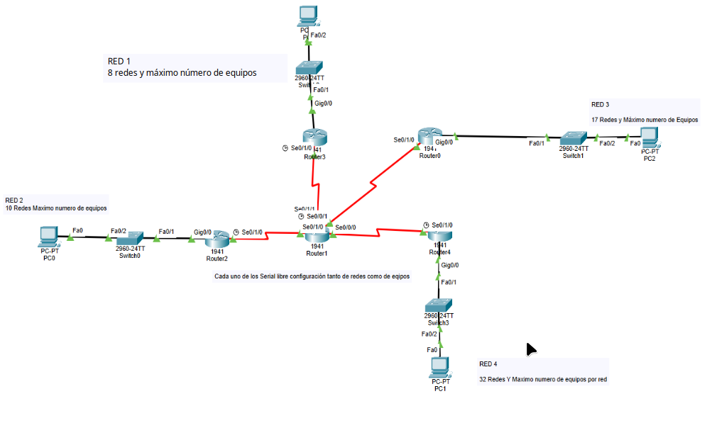

# Caso de estudio 1

Realizar el siguiente ejercicio de subredes.

Se desea configurar cada una de las redes de este esquema para que se cumplan las condiciones marcadas en los rectangulos grises.



# RED 1

## Enunciado

8 subredes con el máximo número de host por cada una de ellas

## Respuesta

- IP LAN: `192.168.1.0/24` (máscara_original=24)
- bits prestados: `3` (2^n = 2³ = 8) (Desde la tabla de potencia – documento de Ruben)
- `nueva_máscara = máscara_original + bits_prestados = 24 + 3 = 27`
- `bits_host = 32 - 27 = 5`
- `salto = 2^5 = 32`
- `host_por_subred = (2^5) - 2 = 30`

|RED 1 - Subred | IP LAN (dirección de red) | Host min | Host max | Broadcast | Host disponibles |
|:--            |:--                        |:--       |:--       |:--        |:-- |      
|RED 1.1 | `192.168.1.0/27` | `192.168.1.1` | `192.168.1.30` | `192.168.1.31` | `30` |
|RED 1.2 | `192.168.1.32/27`| `192.168.1.33`| `192.168.1.62` | `192.168.1.63` | `30` |
|RED 1.3 | `192.168.1.64/27`| `192.168.1.65`| `192.168.1.94` | `192.168.1.95` | `30` |
|RED 1.4 | `192.168.1.96/27`| `192.168.1.97`| `192.168.1.126` | `192.168.1.127` | `30` |
|RED 1.5 | `192.168.1.128/27`| `192.168.1.129`| `192.168.1.158` | `192.168.1.159` | `30` |
|RED 1.6 | `192.168.1.160/27`| `192.168.1.161`| `192.168.1.190` | `192.168.1.191` | `30` |
|RED 1.7 | `192.168.1.192/27`| `192.168.1.193`| `192.168.1.222` | `192.168.1.223` | `30` |
|RED 1.8 | `192.168.1.224/27`| `192.168.1.225`| `192.168.1.254` | `192.168.1.255` | `30` |

---

# RED 2

## Enunciado

10 Redes y máximo números de equipos

## Respuesta

```
subredes = 2^4 = 16
hosts_por_subred = 2^(bits_host) - 2
bits_prestados = nueva_máscara - máscara_original
bits_host = 32 - nueva_máscara
salto = 2^bits_host
```

- IP LAN: `192.168.22.0/24` (máscara_original=24)
- bits prestados: `4 (2^n = 2 ^4 = 16)` (Desde la tabla de potencia – documento de Ruben)
- nueva_máscara = `/28`
- bits_host = `32 - 28 = 4`
- salto = `2^4 = 16`
- host_por_subred = `(2^4) - 2 = 14`

|RED 2.{1-16} | IP LAN (dirección de red) | Host min | Host max | Broadcast | Host disponibles |
|:--            |:--                        |:--       |:--       |:--        |:-- |      
|RED 2.1 | `192.168.22.0/28` |`192.168.22.1` |`192.168.22.14` | `192.168.22.15` | `14` |
|RED 2.2 | `192.168.22.16/28` | `192.168.22.17` | `192.168.22.30` | `192.168.22.31` | `14` |
|RED 2.3 | `192.168.22.32/28` | `192.168.22.33` | `192.168.22.46` | `192.168.22.47` | `14` |
|RED 2.4 | `192.168.22.48/28` | `192.168.22.49` | `192.168.22.62` | `192.168.22.63` | `14` |
|RED 2.5 | `192.168.22.64/28` | `192.168.22.65` | `192.168.22.78` | `192.168.22.79` | `14` |
|RED 2.6 | `192.168.22.80/28` | `192.168.22.81` | `192.168.22.94` | `192.168.22.95` | `14` |
|RED 2.7 | `192.168.22.96/28` | `192.168.22.97` | `192.168.22.110` | `192.168.22.111` | `14` |
|RED 2.8 | `192.168.22.112/28` | `192.168.22.113` | `192.168.22.126` | `192.168.22.127` | `14` |
|RED 2.9 | `192.168.22.128/28` | `192.168.22.129` | `192.168.22.142` | `192.168.22.143` | `14` |
|RED 2.10 | `192.168.22.144/28` | `192.168.22.145` | `192.168.22.158` | `192.168.22.159` | `14` |
|... | `...` | `...` | `...` | `...` | `...` |

---

# RED 3

## Enunciado

Calcular el subnetting para 17 Redes y Máximo numero de Equipos

## Respuesta

- IP LAN: `172.17.0.0/16` (máscara_original=`/21`)
- bits prestados: `5` (`2^n = 2^5 = 32`) (Desde la tabla de potencia o documento de Ruben)
- nueva_máscara = `máscara_original + bits_prestados = 16 + 5 = 21`
- bits_host = `32 - 21 = 11`
- salto = `2^11 = 2048`
- host_por_subred = `(2^11) - 2 = 2046`

|RED 3.{1-17} | IP LAN (dirección de red) | Host min | Host max | Broadcast | Host disponibles |
|:--            |:--                        |:--       |:--       |:--        |:-- |      
|RED 3.1 | `172.17.0.0/21` | `172.17.0.1` | `172.17.7.254` | `172.17.7.255` | `2046` |
|RED 3.2 | `172.17.8.0/21` | `172.17.8.1` | `172.17.15.254` | `172.17.15.255` | `2046` |
|RED 3.3 | `172.17.16.0/21` | `172.17.16.1` | `172.17.23.254` | `172.17.23.255` | `2046` |
|RED 3.4 | `172.17.24.0/21` | `172.17.24.1` | `172.17.31.254` | `172.17.31.255` | `2046` |
|RED 3.<N> | `.../21` | `...` | `...` | `...` | `2046` |
|RED 3.32 | `172.17.248.0/21` | `172.17.248.1` | `172.17.256.254` | `172.17.256.255` | `2046` |

### Nota extra

_Cálculo de la subred `<N>`_

```
red_subred_N = Red_base + (N - 1) × SALTO
```

**Donde:**

- `N` = número de la subred que quieres (`1`, `2`, `3`... `32`)
- `SALTO` = el salto calculado previamente

🧮 _MÉTODO GENERAL PARA CUALQUIER SUBRED_

Ejemplo: Quiero calcular directamente la subred #17

N = 17
Incremento = (17 - 1) × 8 = 16 × 8 = 128

```
Red subred 17: 172.17.(0 + 128).0 = 172.17.128.0/21
Broadcast:     172.17.128.0 + 8 en octeto 3 - 1
              = 172.17.135.255
```

---

# LAN Router2 - Router1

Cálcular un subnetting para solo dos ip host disponible (un ip por cada router)

## Respuesta

- IP LAN (elegida): `192.168.21.0/24` (máscara_original=`/24`) (el tercer octeto seleccionado como `.21.` por relacion a que es la coneción entre Route2 <-> Router1).
- Considerando que solo se necesitan 2 IP para cada uno de los host (router en este caso), la mascára la deducimos que es `/30`
  - bits_prestados = `30 - 24 = 6`
  - bits_host = `32 - 30 = 2`
- salto = `2^2 = 4`
- host_por_subred = `(2^2) - 2 = 2`

|LAN Router2 - Router1 | IP LAN (dirección de red) | Host min | Host max | Broadcast | Host disponibles |
|:--            |:--                        |:--       |:--       |:--        |:-- |      
|LAN R2-R1 | `192.168.21.0/30` | `192.168.21.1` | `192.168.21.2` | `192.168.21.3` | `2` |

---

# LAN Router3 - Router1

Cálcular un subnetting para solo dos ip host disponible (un ip por cada router)

## Respuesta

- IP LAN (elegida): `192.168.31.0/24` (máscara_original=`/24`) (el tercer octeto seleccionado como `.31.` por relacion a que es la coneción entre Route2 <-> Router1).
- Considerando que solo se necesitan 2 IP para cada uno de los host (router en este caso), la mascára la deducimos que es `/30`
  - bits_prestados = `30 - 24 = 6`
  - bits_host = `32 - 30 = 2`
- salto = `2^2 = 4`
- host_por_subred = `(2^2) - 2 = 2`

|LAN Router3 - Router1 | IP LAN (dirección de red) | Host min | Host max | Broadcast | Host disponibles |
|:--            |:--                        |:--       |:--       |:--        |:-- |      
|LAN R3-R1 | `192.168.31.0/30` | `192.168.31.1` | `192.168.31.2` | `192.168.31.3` | `2` |

---

# LAN Router4 - Router1

Cálcular un subnetting para solo dos ip host disponible (un ip por cada router)

## Respuesta

- IP LAN (elegida): `192.168.41.0/24` (máscara_original=`/24`) (el tercer octeto seleccionado como `.41.` por relacion a que es la coneción entre Route2 <-> Router1).
- Considerando que solo se necesitan 2 IP para cada uno de los host (router en este caso), la mascára la deducimos que es `/30`
  - bits_prestados = `30 - 24 = 6`
  - bits_host = `32 - 30 = 2`
- salto = `2^2 = 4`
- host_por_subred = `(2^2) - 2 = 2`


|LAN Router4 - Router1 | IP LAN (dirección de red) | Host min | Host max | Broadcast | Host disponibles |
|:--            |:--                        |:--       |:--       |:--        |:-- |      
|LAN R4-R1 | `192.168.41.0/30` | `192.168.41.1` | `192.168.41.2` | `192.168.41.3` | `2` |

---

# Anexo / referencias

## Documentación consultada

- Documento PDF, profesor Rúben

## Formulas útiles y/o utilizadas

```
subredes = 2^(bits_prestados)
hosts_por_subred = 2^(bits_host) - 2
bits_prestados = nueva_máscara - máscara_original
bits_host = 32 – nueva_máscara
salto = 2^bits_host
```
