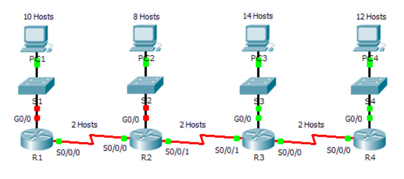

# Caso de estudio *subnetting*

Packet Tracer: Situación de división en subredes 2

## Enunciado

### Topología



### Tabla de direccionamiento

| Dispositivo | Interfaz | Dirección IP | Máscara de subred | Gateway predeterminado |
|-------------|----------|--------------|-------------------|------------------------|
| R1          | G0/0     |  `172.31.1.3`            |    `27`               | No aplicable           |
| R1          | S0/0/0   |   172.31.31.225           |   `27`                | No aplicable           |
| R2          | G0/0     | 172.31.31.34             |   `27`                | No aplicable           |
| R2          | S0/0/0   |   172.31.31.226           |   27                | No aplicable           |
| R2          | S0/0/1   | 172.31.31.193             | 27                   | No aplicable           |
| R3          | G0/0     |   172.31.31.66           |    27               | No aplicable           |
| R3          | S0/0/0   | 172.31.31.161             | 27                   | No aplicable           |
| R3          | S0/0/1   |  172.31.31.194          | 27                  | No aplicable           |
| R4          | G0/0     |172.31.31.97              |   27                | No aplicable           |
| R4          | S0/0/0   | 172.31.31.162             | 27                  | No aplicable           |
| S1          | VLAN 1   | 172.31.1.30             |    27               |   172.31.1.3                     |
| S2          | VLAN 1   |   172.31.1.62           |   27         |        172.31.31.34                    |
| S3          | VLAN 1   |  172.31.1.94            |   27                |    172.31.31.66                 |
| S4          | VLAN 1   |   172.31.1.126           |                   |                        |
| PC1         | NIC      |  172.31.1.11          |   27                |     172.31.1.3                   |
| PC2         | NIC      |   172.31.31.38           |   27                |    172.31.31.34                    |
| PC3         | NIC      |   172.31.31.68           |    27               |      172.31.31.66                  |
| PC4         | NIC      |  172.31.31.98            |  27                 |                        |

## Objetivos

- Parte 1: Diseñar un esquema de direccionamiento IP
- Parte 2: Asignar direcciones IP a los dispositivos de red y verificar la conectividad 
  
## Situación

En esta actividad, se le asigna la dirección de red `172.31.1.0/24` para que la divida en subredes y proporcione direccionamiento IP para la red que se muestra en la topología. Las direcciones de host requeridas para cada enlace WAN y LAN se muestran en la topología.

### Parte 1: Diseñar un esquema de direccionamiento IP

Paso 1: Divida la red `172.31.1.0/24` en subredes de acuerdo con la cantidad máxima de hosts que requiere la subred más extensa.

- a. Según la topología, ¿cuántas subredes se necesitan? ***7***

## Resolución

**Especificación inicial**

- IP LAN: `172.31.1.0/24`.
- Cantidad de subredes iniciales (necesarias): `7`.
- Cantidad de host por cada subred (LAN) (es la que mas ip host necesita): `14`.

**Resolviendo** (ver formulas en *Anexo/referencias*)

`bits_prestados = 3` (ya que subredes = 2^3 = 8 con lo que cubrimos las 7 subredes que necesitamos)
`host_por_subred = 2^(5) - 2 = 30` (También cubrimos mas de los 14 host necesarios, para la red de S3)
`3 = nueva_máscara - 24` => `nueva_máscara = 24 + 3 = 27`  
`bits_host = 32 - 27 = 5`
`salto = 2^5 = 32`

|SUB LAN | IP LAN (dirección de red) | Host min | Host max | Broadcast | Host disponibles |
|:--            |:--                        |:--       |:--       |:--        |:-- |      
|1 | `172.31.1.0/27` | `172.31.1.1` | `172.31.1.30` | `172.31.1.31` | `30` |
|2 | `172.31.31.32/27`| `.33`| `.62` | `.63` | `30` |
|3 | `172.31.31.64/27`| `.65`| `.94` | `.95` | `30` |
|4 | `172.31.31.96/27`| `.97`| `.126` | `.127` | `30` |
|5 | `172.31.31.128/27`| `.129`| `.158` | `.159` | `30` |
|6 | `172.31.31.160/27`| `.161`| `.190` | `.191` | `30` |
|7 | `172.31.31.192/27`| `.193`| `.222` | `.223` | `30` |
|8 | `172.31.31.224/27`| `.225`| `.254` | `.255` | `30` |

# Anexo / referencias

## Documentación consultada

- Documento PDF, profesor Rúben

## Formulas útiles y/o utilizadas

```
subredes = 2^(bits_prestados)
hosts_por_subred = 2^(bits_host) - 2
bits_prestados = nueva_máscara - máscara_original
bits_host = 32 - nueva_máscara
salto = 2^bits_host
```
