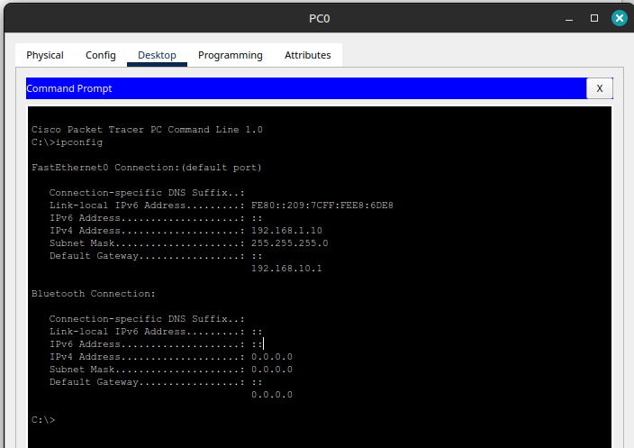
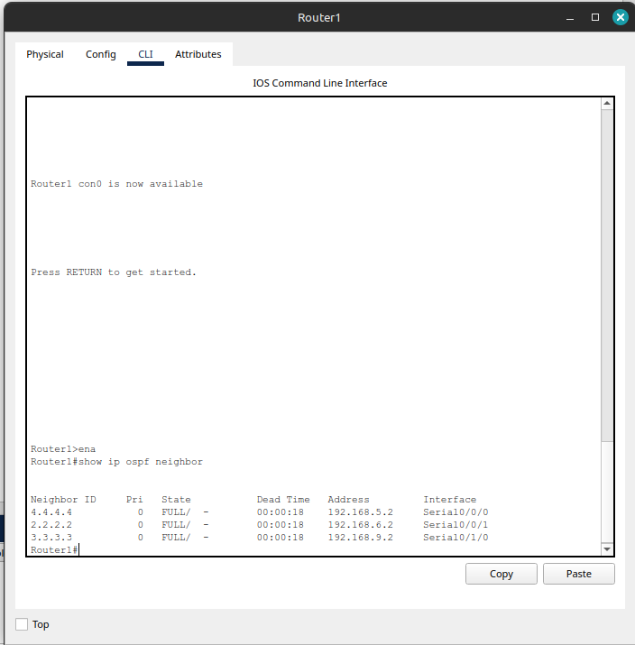
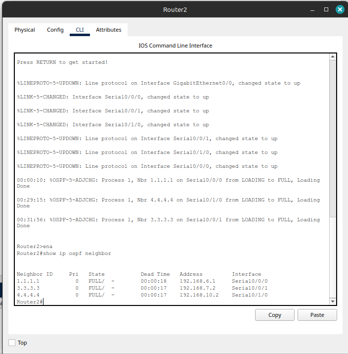
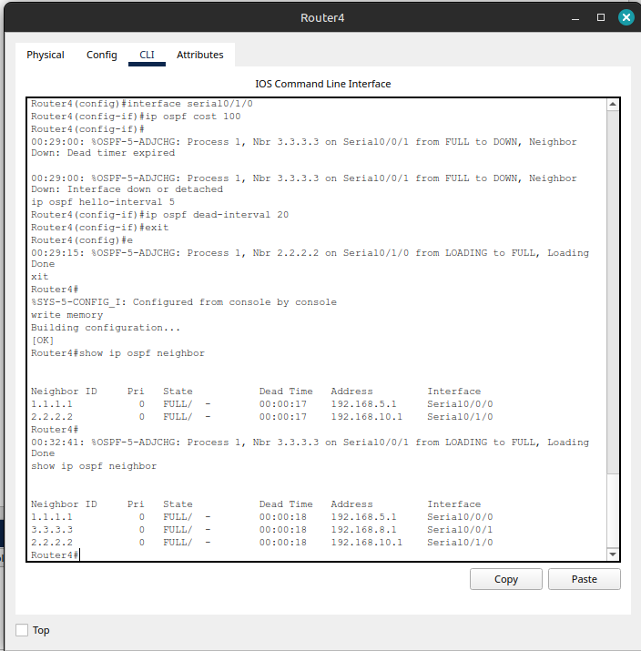

# Ejercicio_2

## Enunciado

Sobre la siguiente topología de red, implementar una configuración de router de alta disponibilidad cumpliendo con los siguientes requisitos, estos son:

- Configuración de IP sobre los activos (principalmente de tipo router), como asignación fija o estática.
- No utilzar ruteo RIP entre los router.
- Configuración de alta disponibilidad, que sea capaz de mantener el servicio de ruteo en caso de falla de algunas de las conexiones del backbone principal.

## Representación de la topología

En la representación [topología Ejercicio 2][ejercicio-2] se muestra la topología de interconexión lógica del escenario.

![topología Ejercicio 2][ejercicio_2]

[ejercicio_2]: ../images/ejercicio_2.png

## Resolución

### Justificación inicial

Para la resolución de este escenario, y debido principalmente a que *no* debe utilizarse direccionamiento *RIP*, para la configuración de asignación de IP sobre los router se utilizará:

- ✅ ***Asignación IP estática:*** Todos los **routers** tienen **IP**s **fijas** configuradas.
- ✅ ***Sin RIP:*** Se utiliza ***Open Shortest Path First*** (***OSPF***) como protocolo de enrutamiento dinámico.
- ✅ ***Alta disponibilidad:*** Se configuro **Topología full-mesh entre routers** que **garantiza redundancia**. Esta configuración es implementada configurando **Open Shortest Path First** (**OSPF**). es un protocolo de enrutamiento que permite a los routers compartir automáticamente información sobre las rutas disponibles en la red. Es como un sistema de mapas inteligente donde cada router conoce todos los caminos posibles para llegar a cualquier destino.

**Nota *uso de Packet Tracer* y/o *CLI IOS* para esta resolución:** Para configurar la **OSPF**, y debido a que **Packet Tracer** no soporta completamente el configurar los activos de escenarios con esta caracteristica, es que se utiliza en la resolución de este laboratorio el `CLI IOS` para configurar la *topología full-mesh* cuando sea requerido en este documento. De todos modos, en este informe se adjunta tanto capturas de la interface gráfica de *"Cisco Packet Tracer"*  como los comandos emitidos para la configuración de cada activo, según corresponda.

### Configuración IPv4 estática

En este apartado se muestra la configuración inicial que se le asigno a cada uno de los activos, principalmente los de tipo PC y a los Router. Se revisa así tanto el nombre, como la asignación de IPv4 fija/estática, para cumpliendo con uno de los requisitos iniciales.

<!--
#### PC0



#### PC1


#### PC2


#### PC3


-->
#### Revisión nombre host e `ipconfig` en las PC

En este item mediante capturas de la interface de *Cisco Packet Tracer* se muestra la asignación de IPv4 establecidas sobre las PC del escenario.

|||
|:--:|:--:|
|||
|PC0 - `ipconfig`|PC1 - `ipconfig`|

|||
|:--:|:--:|
|||
|PC2 - `ipconfig`|PC3 - `ipconfig`|

#### Revisión nombre router y asignación de IPv4

En este item mediante sesión de comandos *Cisco IOS* ejecutados sobre cada uno de los Router se muestra la asignación de IPv4 sobre cada uno de las interface de cada uno de los router.

***[Router1]** (nombre activo y revisión configuración IPv4)*

```c
Router1>enable
Router1#show running-config | section interface
interface GigabitEthernet0/0
 ip address 192.168.1.1 255.255.255.0
 duplex auto
 speed auto
interface GigabitEthernet0/1
 no ip address
 duplex auto
 speed auto
 shutdown
interface Serial0/0/0
 ip address 192.168.5.1 255.255.255.252
interface Serial0/0/1
 ip address 192.168.6.1 255.255.255.252
interface Serial0/1/0
 ip address 192.168.9.1 255.255.255.252
interface Serial0/1/1
 no ip address
 clock rate 2000000
interface Vlan1
 no ip address
 shutdown
```

***[Router2]***

```c
Router2>enable
Router2#show running-config | section interface
interface GigabitEthernet0/0
 ip address 192.168.4.1 255.255.255.0
 duplex auto
 speed auto
interface GigabitEthernet0/1
 no ip address
 duplex auto
 speed auto
 shutdown
interface Serial0/0/0
 ip address 192.168.6.2 255.255.255.252
 clock rate 2000000
interface Serial0/0/1
 ip address 192.168.7.1 255.255.255.252
interface Serial0/1/0
 ip address 192.168.10.1 255.255.255.252
interface Serial0/1/1
 no ip address
 clock rate 2000000
interface Vlan1
 no ip address
 shutdown
```

***[Router3]***

```c
Router3>enable
Router3#show running-config | section interface
interface GigabitEthernet0/0
 ip address 192.168.3.1 255.255.255.0
 duplex auto
 speed auto
interface GigabitEthernet0/1
 no ip address
 duplex auto
 speed auto
 shutdown
interface Serial0/0/0
 ip address 192.168.7.2 255.255.255.252
 clock rate 2000000
interface Serial0/0/1
 ip address 192.168.8.1 255.255.255.252
interface Serial0/1/0
 ip address 192.168.9.2 255.255.255.252
 clock rate 2000000
interface Serial0/1/1
 no ip address
 clock rate 2000000
 shutdown
interface Vlan1
 no ip address
 shutdown
```

***[Router4]***

```c
Router4>
Router4>ena
Router4#show running-config | section interface
interface GigabitEthernet0/0
 ip address 192.168.2.1 255.255.255.0
 duplex auto
 speed auto
interface GigabitEthernet0/1
 no ip address
 duplex auto
 speed auto
 shutdown
interface Serial0/0/0
 ip address 192.168.5.2 255.255.255.252
 clock rate 2000000
interface Serial0/0/1
 ip address 192.168.8.2 255.255.255.252
 clock rate 2000000
interface Serial0/1/0
 ip address 192.168.10.2 255.255.255.252
 clock rate 2000000
interface Serial0/1/1
 no ip address
 clock rate 2000000
 shutdown
interface Vlan1
 no ip address
 shutdown
```

#### Configuración OFCT

***[Router4]** (Configuración desde el CLI IOS)*

```c
Router4> enable
Router4# configure terminal

! Limpiar configuración OSPF anterior
Router4(config)# no router ospf 1

! Nueva configuración OSPF optimizada
Router4(config)# router ospf 1
Router4(config-router)# router-id 4.4.4.4

! Red LAN en Área 4 (sucursal)
Router4(config-router)# network 192.168.2.0 0.0.0.255 area 4

! Enlaces WAN en Área 0 (backbone) - TODAS las conexiones directas
Router4(config-router)# network 192.168.5.0 0.0.0.3 area 0
Router4(config-router)# network 192.168.8.0 0.0.0.3 area 0
Router4(config-router)# network 192.168.10.0 0.0.0.3 area 0

! Salir del modo router (omitimos timers)
Router4(config-router)# exit

! Configurar TODAS las interfaces seriales activas
Router4(config)# interface serial0/0/0
Router4(config-if)# ip ospf cost 100
Router4(config-if)# ip ospf hello-interval 5
Router4(config-if)# ip ospf dead-interval 20
Router4(config-if)# exit

Router4(config)# interface serial0/0/1
Router4(config-if)# ip ospf cost 100
Router4(config-if)# ip ospf hello-interval 5
Router4(config-if)# ip ospf dead-interval 20
Router4(config-if)# exit

Router4(config)# interface serial0/1/0
Router4(config-if)# ip ospf cost 100
Router4(config-if)# ip ospf hello-interval 5
Router4(config-if)# ip ospf dead-interval 20
Router4(config-if)# exit

Router4(config)# exit
Router4# write memory
```

Por fines mas didácticos y/o visuales, en esta [captura][router4-sesion-cli-ios-setting-ospf] se muestra la sesión de comandos CLI IOS ejecutados en Router4 para la configuración de OSPF.

![Router4 configuración OSPF][router4-sesion-cli-ios-setting-ospf]

[router4-sesion-cli-ios-setting-ospf]: ../images/ejercicio_2-router4-sesion-cli-ios-setting-ospf.png

#### 🎉 Verificación final

La configuración en principio ha sido realizada, en este apartado se realiza una verificación para ver la configuración final de los respectivos router.

##### Primera verificación

En este apartado con básicamente el comando `show ip ospf neighbor` (correctamente ejecutado y sobre c/u de los router) aseguramos que cada router ve a su *vecino*. Siendo los resultados esperados tal que:

- Router1 debería ver: 3 vecinos (`2.2.2.2`, `3.3.3.3` y `4.4.4.4`)
- Router2 debería ver: 3 vecinos (`1.1.1.1`, `3.3.3.3` y `4.4.4.4`)
- Router3 debería ver: 3 vecinos (`1.1.1.1`, `2.2.2.2` y `4.4.4.4`)
- Router4 debería ver: 3 vecinos (`1.1.1.1`, `2.2.2.2` y `3.3.3.3`)

La ejecución de este comando en cada uno de los router es mostrada en las capturas siguientes.

|||
|:--:|:--:|
|||
|Router1 `show ip ospf neighbor`|Router2 `show ip ospf neighbor`|

|||
|:--:|:--:|
|||
|Router3 `show ip ospf neighbor`|Router4 `show ip ospf neighbor`|

##### 📊 Prueba Rápida (Opcional)

En este apartado ejecutamos `show ip route ospf` (correctamente) para revisar de ver las rutas hacia las redes *vecinas* de cada uno de los router.

- *[Router1]*
  
  ```c
  Router1>ena
  Router1#show ip route ospf
  O IA 192.168.2.0 [110/101] via 192.168.5.2, 00:31:13, Serial0/0/0
  O IA 192.168.3.0 [110/165] via 192.168.5.2, 00:31:13, Serial0/0/0
  O IA 192.168.4.0 [110/101] via 192.168.6.2, 00:57:29, Serial0/0/1
       192.168.7.0/30 is subnetted, 1 subnets
  O       192.168.7.0 [110/200] via 192.168.6.2, 00:57:29, Serial0/0/1
       192.168.8.0/30 is subnetted, 1 subnets
  O       192.168.8.0 [110/164] via 192.168.5.2, 00:31:13, Serial0/0/0
       192.168.10.0/30 is subnetted, 1 subnets
  O       192.168.10.0 [110/164] via 192.168.5.2, 00:31:13, Serial0/0/0
  ```

- *[Router2]*
  
  ```c
  Router2>ena
  Router2#show ip route ospf
  O IA 192.168.1.0 [110/101] via 192.168.6.1, 00:59:00, Serial0/0/0
  O IA 192.168.2.0 [110/201] via 192.168.6.1, 00:32:39, Serial0/0/0
  O IA 192.168.3.0 [110/265] via 192.168.6.1, 00:32:39, Serial0/0/0
       192.168.5.0/30 is subnetted, 1 subnets
  O       192.168.5.0 [110/200] via 192.168.6.1, 00:59:00, Serial0/0/0
       192.168.8.0/30 is subnetted, 1 subnets
  O       192.168.8.0 [110/264] via 192.168.6.1, 00:32:39, Serial0/0/0
       192.168.9.0/30 is subnetted, 1 subnets
  O       192.168.9.0 [110/200] via 192.168.6.1, 00:59:00, Serial0/0/0
  ```

- *[Router3]*
  
  ```c
  Router3>ena
  Router3#show ip route ospf
  O IA 192.168.1.0 [110/165] via 192.168.8.2, 00:28:26, Serial0/0/1
  O IA 192.168.2.0 [110/65] via 192.168.8.2, 00:28:26, Serial0/0/1
  O IA 192.168.4.0 [110/265] via 192.168.8.2, 00:28:26, Serial0/0/1
       192.168.5.0/30 is subnetted, 1 subnets
  O       192.168.5.0 [110/164] via 192.168.8.2, 00:28:26, Serial0/0/1
       192.168.6.0/30 is subnetted, 1 subnets
  O       192.168.6.0 [110/264] via 192.168.8.2, 00:28:26, Serial0/0/1
       192.168.10.0/30 is subnetted, 1 subnets
  O       192.168.10.0 [110/128] via 192.168.8.2, 00:28:26, Serial0/0/1
  ```

- *[Router4]*
  
  ```c
  Router4>ena
  Router4#show ip route ospf
  O IA 192.168.1.0 [110/101] via 192.168.5.1, 00:36:56, Serial0/0/0
  O IA 192.168.3.0 [110/65] via 192.168.8.1, 00:03:06, Serial0/0/1
  O IA 192.168.4.0 [110/201] via 192.168.5.1, 00:36:56, Serial0/0/0
       192.168.6.0/30 is subnetted, 1 subnets
  O       192.168.6.0 [110/200] via 192.168.5.1, 00:36:56, Serial0/0/0
       192.168.7.0/30 is subnetted, 1 subnets
  O       192.168.7.0 [110/128] via 192.168.8.1, 00:36:56, Serial0/0/1
       192.168.9.0/30 is subnetted, 1 subnets
  O       192.168.9.0 [110/128] via 192.168.8.1, 00:36:56, Serial0/0/1
  ```

### 📊 Resumen de la configuración aplicada/escenario logrado

✅ Red full-mesh con 4 routers y 6 enlaces WAN
 
✅ Router-IDs únicos (1.1.1.1 a 4.4.4.4)

✅ Diseño por áreas OSPF jerárquico (Áreas 0-4)

✅ Timers optimizados (detección de fallas en 20 seg)

✅ Convergencia rápida y redundancia total

✅ Configuración profesional nivel empresarial

### 🎓 Conceptos que se han utilizado/aprendido

- ***OSPF Multi-área*** - Diseño jerárquico escalable
- ***Router-ID*** - Identificación única de dispositivos
- ***Full-mesh*** - Máxima redundancia posible
- ***Optimización de timers*** - Hello/Dead intervals
- ***Costos OSPF*** - Manipulación de métricas
- ***Wildcard masks*** - Configuración precisa de redes
